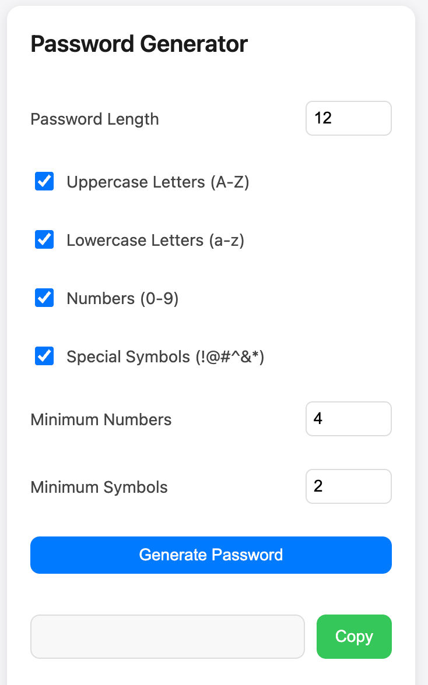

# Password Generator Chrome Extension

A concise and powerful password generator Chrome extension with customizable generation strategies and internationalization support.

English | [简体中文](./README_zh.md)

## ✨ Features

- 🎯 Customizable Password Generation
  - Password length (5-50 characters)
  - Character types (uppercase, lowercase, numbers, symbols)
  - Minimum requirements for numbers and symbols
- 💾 Auto-save Configuration
  - Remember last settings
  - Keep last 3 generated passwords
- 🌍 Multi-language Support
  - English
  - Chinese
- 🖱️ Quick Generate via Context Menu
  - Right-click to generate password anywhere
  - Auto-copy to clipboard
- 🎨 Modern Interface
  - Clean and elegant design
  - Material Design
  - Dark mode support

## 🚀 Installation

1. Install from [Chrome Web Store](https://chrome.google.com/webstore) (Coming soon)

Or

1. Download and extract ZIP file from this repository
2. Open Chrome browser and navigate to extensions page (`chrome://extensions`)
3. Enable "Developer mode" in the top right
4. Click "Load unpacked"
5. Select the extracted folder

## 🔨 Usage

### Via Extension Icon

1. Click the extension icon in Chrome toolbar
2. Adjust password generation settings as needed
3. Click "Generate Password" button
4. Click "Copy" to copy password to clipboard

### Via Context Menu

1. Right-click anywhere on any page
2. Select "Generate Password"
3. Password will be generated and copied to clipboard automatically

## ⚙️ Configuration

- **Password Length**: 5-50 characters
- **Character Types**:
  - Uppercase letters (A-Z)
  - Lowercase letters (a-z)
  - Numbers (0-9)
  - Special symbols (!@#$%^&*)
- **Minimum Requirements**:
  - Minimum number of digits
  - Minimum number of symbols

## 🛡️ Privacy

- This extension does not collect or transmit any user data
- All configurations and history are stored locally
- Generated passwords are processed locally only

## 🤝 Contributing

Contributions are welcome! Feel free to submit Issues and Pull Requests.

1. Fork the repository
2. Create your feature branch (`git checkout -b feature/AmazingFeature`)
3. Commit your changes (`git commit -m 'Add some AmazingFeature'`)
4. Push to the branch (`git push origin feature/AmazingFeature`)
5. Open a Pull Request

## 📝 License

This project is licensed under the [MIT License](LICENSE) - see the [LICENSE](LICENSE) file for details.

## 🙏 Acknowledgments

- Icons by [Icons8](https://icons8.com)
- UI Framework: Material Design