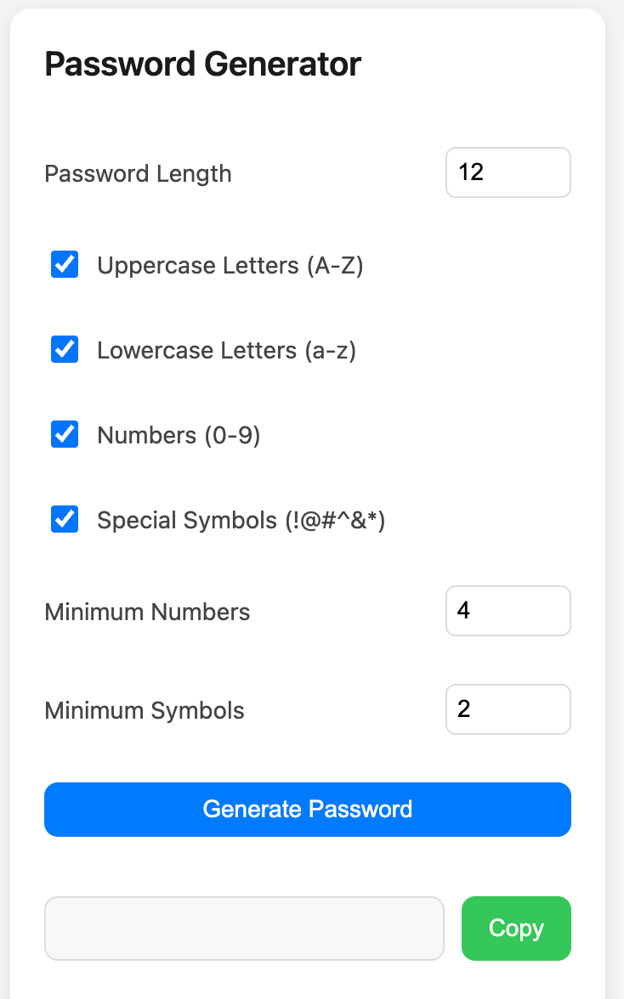

# Password Generator Chrome Extension

一个简洁、强大的密码生成器 Chrome 扩展，支持自定义密码生成策略和国际化。

[English](./README.md) | 简体中文

## ✨ 特性

- 🎯 自定义密码生成策略
  - 密码长度（5-50字符）
  - 字符类型（大写字母、小写字母、数字、特殊符号）
  - 最小数字和符号数量要求
- 💾 配置自动保存
  - 记住上次的配置设置
  - 保存最近3次生成的密码
- 🌍 多语言支持
  - English
  - 中文
- 🖱️ 右键菜单快速生成
  - 在任意页面右键即可生成密码
  - 自动复制到剪贴板
- 🎨 现代化界面
  - 简洁优雅的设计
  - 符合 Material Design 规范
  - 深色模式支持

## 🚀 安装

1. 从 [Chrome Web Store](https://chrome.google.com/webstore) 安装（即将上线）

或者

1. 下载此仓库的 ZIP 文件并解压
2. 打开 Chrome 浏览器，进入扩展管理页面 (`chrome://extensions`)
3. 开启右上角的"开发者模式"
4. 点击"加载已解压的扩展程序"
5. 选择解压后的文件夹

## 🔨 使用方法

### 通过扩展图标

1. 点击 Chrome 工具栏中的扩展图标
2. 根据需要调整密码生成策略
3. 点击"生成密码"按钮
4. 点击"复制"按钮将密码复制到剪贴板

### 通过右键菜单

1. 在任意页面右键
2. 选择"生成密码"选项
3. 密码将自动生成并复制到剪贴板

## ⚙️ 配置选项

- **密码长度**: 5-50 个字符
- **字符类型**:
  - 大写字母 (A-Z)
  - 小写字母 (a-z)
  - 数字 (0-9)
  - 特殊符号 (!@#$%^&*)
- **最小要��**:
  - 数字最少个数
  - 符号最少个数

## 🛡️ 隐私声明

- 此扩展不会收集或传输任何用户数据
- 所有配置和历史记录仅保存在本地
- 生成的密码仅在本地处理，不会发送到任何服务器

## 🤝 贡献

欢迎提交 Issue 和 Pull Request！

1. Fork 此仓库
2. 创建您的特性分支 (`git checkout -b feature/AmazingFeature`)
3. 提交您的更改 (`git commit -m 'Add some AmazingFeature'`)
4. 推送到分支 (`git push origin feature/AmazingFeature`)
5. 打开一个 Pull Request

## 📝 开源协议

此项目使用 [MIT](LICENSE) 协议 - 查看 [LICENSE](LICENSE) 文件了解详情

## 🙏 致谢

- 图标设计：[Icons8](https://icons8.com)
- UI 框架：Material Design 